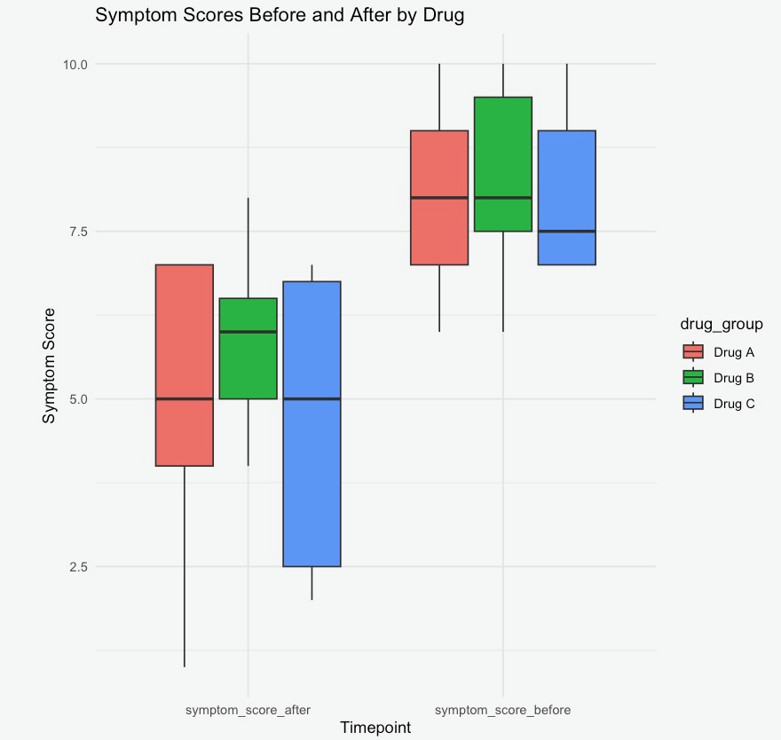

# DrugEffectivenessComparison

A statistical analysis comparing the effectiveness of different drugs based on patient outcomes.

## 📊 Overview

This analysis compares symptom scores before and after treatment with different drugs. It includes:

- Data loading and cleaning
- Visualization using boxplots
- Summary statistics
- Paired t-tests

## 📁 Files

- `drug_effectiveness_data.csv`: The dataset
- `DrugEffectivenessAnalysis.ipynb`: The Jupyter Notebook with all code and results

## 📊 Boxplot Visualization

This plot shows symptom scores before and after treatment with each drug:

## 🛠️ Tools Used

- R (via IRKernel in Jupyter)
- `tidyverse`, `ggplot2`, `dplyr`, `tidyr`

## ✅ Result Summary

- Drug A showed a **mean improvement** of X
- Drug B showed a **mean improvement** of Y
- p-value of 0.0001 suggests a significant difference

